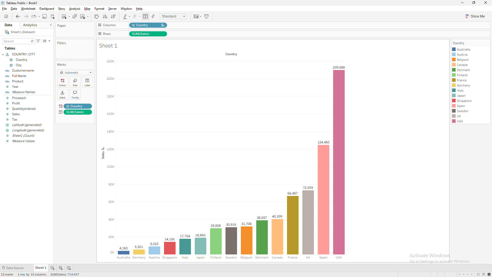
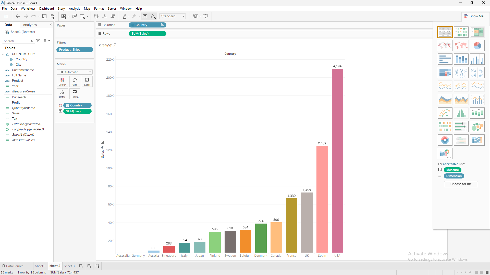
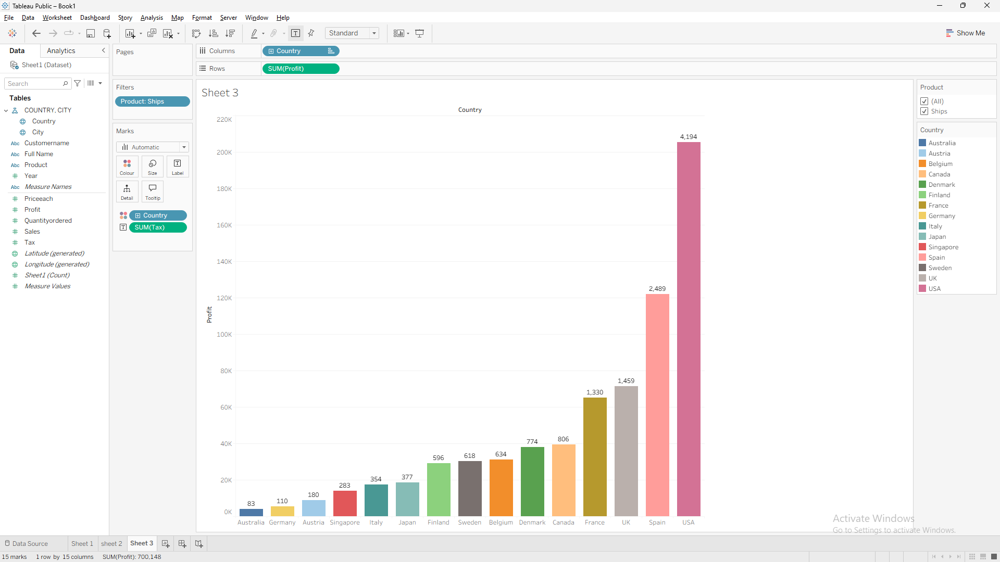

# Tableau Sales Analysis

This is my first Tableau project where I analyzed **Sales, Tax, and Profit** across different countries using a sales dataset.

I created bar charts, applied filters, and compared country-wise performance to gain business insights. Through this project, I learned the basics of Tableau, including data visualization, dimensions and measures, filters, and worksheet creation.

## Skills Used
- Tableau Public
- Data Visualization
- Bar Charts
- Filters
- Data Analysis

## Project Screenshots

### Sales by Country

### Tax by Country (Ships Product)

### Profit by Country (Ships Product)

## Key Learning
- Connected and explored datasets in Tableau
- Created bar charts
- Applied filters for product analysis
- Compared Sales, Tax, and Profit across countries
- Gained business insights through data visualization